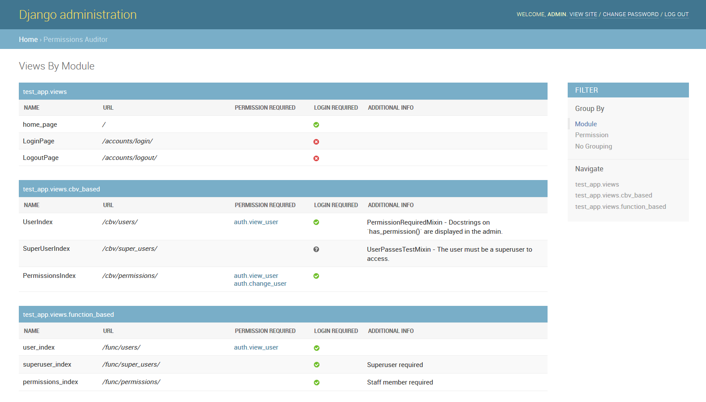

Admin Site
============

Once installed, you should see a `Permissions Auditor` category in your Django admin panel.

.. image:: img/admin_category.png

.. note::
    All staff members will be able to access the index.

Views Index
-----------

Your registered site views should display with the permissions required and any additional information
in the table.

.. note::
    If you see unexpected results, or missing permissions, ensure your :ref:`processors` are correctly
    configured. You may need to create a custom processor if you have a view that does not use
    the built-in Django auth mixins / decorators.

When you click on a permission, you will be taken to a page which will allow you to manage
what users and groups have that permission.

Permissions Management Page
---------------------------

.. image:: img/admin_permissions.png

.. note::
    In order to modify permissions on this page, the user must have the ``auth.change_user`` and
    ``auth.change_group`` permissions.
