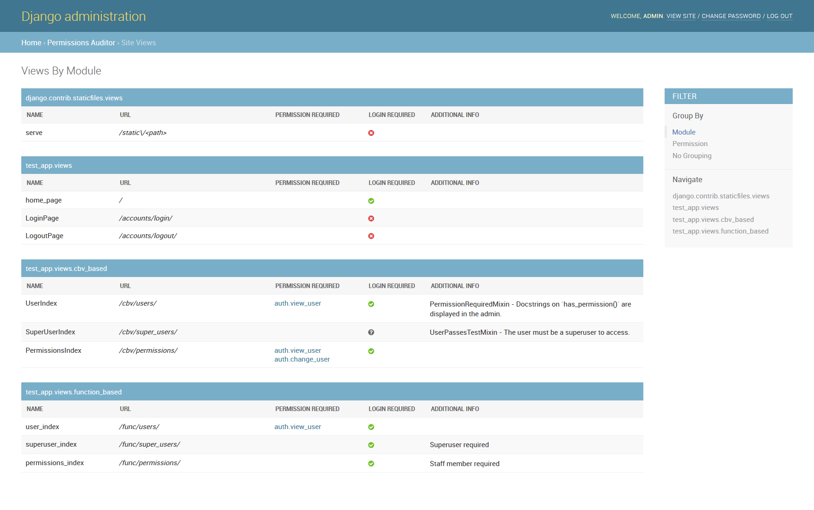

.. django-permissions-auditor documentation master file, created by
   sphinx-quickstart on Thu Jan  3 10:52:36 2019.

django-permissions-auditor
======================================================

Admin site for auditing and managing permissions for views in your Django app.

Features
--------

* Automatically parse views registered in Django's URL system
* Out of the box support for Django's authentication system
* Easily extensible for custom permission schemes

.. include:: installation.rst

Contribute
----------

- Issue Tracker: https://github.com/AACEngineering/django-permissions-auditor/issues
- Source Code: https://github.com/AACEngineering/django-permissions-auditor

License
-------

The project is licensed under the MIT license.

.. toctree::
   :maxdepth: 2
   :caption: Contents:

   overview
   installation
   settings
   admin_site
   management_commands
   example
   processors/index
   custom_processors
   changelog
